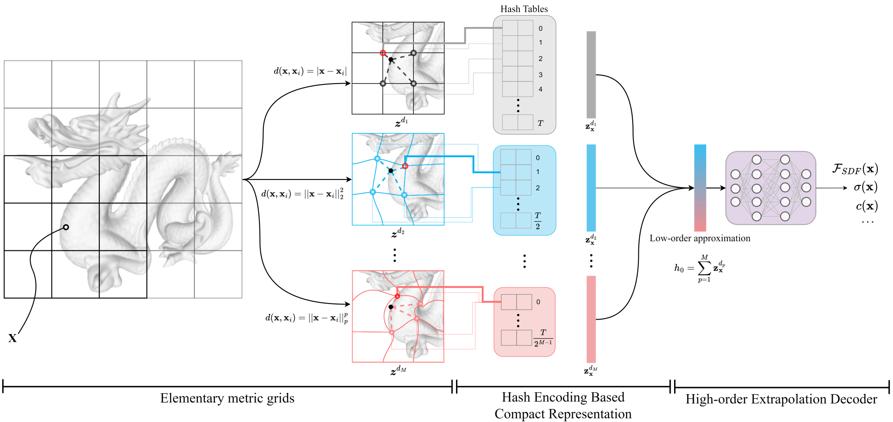

# MetricGrids
This repository contains an official PyTorch implementation for the paper "MetricGrids:  Arbitrary Nonlinear Approximation with Elementary Metric Grids based Implicit Neural Representation" in CVPR 2025.
<div align="center">
    <a href="https://arxiv.org/abs/2503.10000"></a>
    <a href="https://opensource.org/licenses/MIT"></a>
</div>
<br>
<div align="center">
Shu Wang, Yanbo Gao, Shuai Li, Chong Lv, Xun Cai, Chuankun Li, Hui Yuan, Jinglin Zhang
</div>

<div align="center">
Shandong University, North University of China
</div>
<div align="center">
</div>



## Setup
### Clone
```bash
git clone https://github.com/wangshu31/MetricGrids.git
cd MetricGrids
```
This repository has been tested on **Ubuntu 20.04.6** with **PyTorch 2.0.1 + CUDA 11.8** on an **NVIDIA RTX 3090** GPU.


### Install conda environment
> Note: Our implementations are heavily based on the [NeuRBF](https://github.com/oppo-us-research/NeuRBF). 
> Please also refer to their codebase for further details.

```bash
conda create -n metricgrids python=3.9 -y
conda activate metricgrids

# Install CuPy
pip install cupy-cuda11x
python -m cupyx.tools.install_library --cuda 11.x --library cutensor
python -m cupyx.tools.install_library --cuda 11.x --library cudnn
python -m cupyx.tools.install_library --cuda 11.x --library nccl

# Install PyTorch
pip install torch==2.0.1+cu118 torchvision==0.15.2+cu118 --index-url https://download.pytorch.org/whl/cu118

# Install Packages
pip install einops matplotlib kornia imageio imageio-ffmpeg opencv-python pysdf PyMCubes trimesh plotly scipy GPUtil scikit-image scikit-learn pykdtree commentjson tqdm configargparse lpips tensorboard torch-ema ninja tensorboardX numpy pandas rich packaging scipy torchmetrics jax pillow plyfile omegaconf
pip install jax tqdm pillow opencv-python pandas lpips imageio torchmetrics scikit-image tensorboard matplotlib
pip install git+https://github.com/NVlabs/tiny-cuda-nn/#subdirectory=bindings/torch
pip install nerfacc

# Build torch-ngp extension
cd thirdparty/torch_ngp/gridencoder
pip install .
cd ../../../
```

## Experiments
### Image
Please download the Kodak dataset and place it in the `data/img/Kodak` directory. Model parameter settings can be found in `configs/img.py`. To train the model on all Kodak images in a single run, use the following command:
```bash
./Kodak.sh
```
The result and tensorboard log will be located in `log/img`. You can adjust the model size by modifying the `--log2_hashmap_size_ref` argument.

To train on a gigapixel image, use the following command:
```bash
python main.py --config configs/img_giga.py --path <path/to/image> --log2_hashmap_size_ref 24 --alias 'exp_name'
```

### SDF
Following [NeuRBF](https://github.com/oppo-us-research/NeuRBF), download .ply files from the [Stanford 3D Scanning Repository](https://graphics.stanford.edu/data/3Dscanrep/) and place them in the `data/sdf` directory.
Then, run the following preprocessing script, which normalizes the mesh and samples additional evaluation points:
```bash
python preproc_mesh.py --path <path/to/.ply file>
```
Then run the following command to evaluate all 7 objects:
```bash
./sdf.sh
```
The result and tensorboard log will be located in `log/sdf`.

### NeRF

The novel view synthesis experiments in this repository are accelerated using the **Occupancy Grid Estimator** from [NerfAcc](https://github.com/nerfstudio-project/nerfacc).

Download the dataset from [Offical Google Drive](https://drive.google.com/drive/folders/1cK3UDIJqKAAm7zyrxRYVFJ0BRMgrwhh4) and place it in the `data/nerf_synthetic` directory.

To start training, run the following command:

```bash
python nerfacc/examples/train_ngp_nerf_occ.py --scene <scene_name e.g. lego> --data_root ./data/nerf_synthetic
```

## Acknowledgement

We sincerely thank the authors of the following codebases. Their excellent work provided valuable references for our project: [NeuRBF](https://github.com/oppo-us-research/NeuRBF), [nrff](https://github.com/imkanghan/nrff), [SCONE](https://github.com/jasonli0707/scone), and [SIREN](https://github.com/vsitzmann/siren).

## Citation

If you find MetricGrids is useful for your research and applications, please consider citing:
```
@article{wang2025metricgrids,
  title={MetricGrids: Arbitrary Nonlinear Approximation with Elementary Metric Grids based Implicit Neural Representation},
  author={Wang, Shu and Gao, Yanbo and Li, Shuai and Lv, Chong and Cai, Xun and Li, Chuankun and Yuan, Hui and Zhang, Jinglin},
  journal={arXiv preprint arXiv:2503.10000},
  year={2025}
}
```